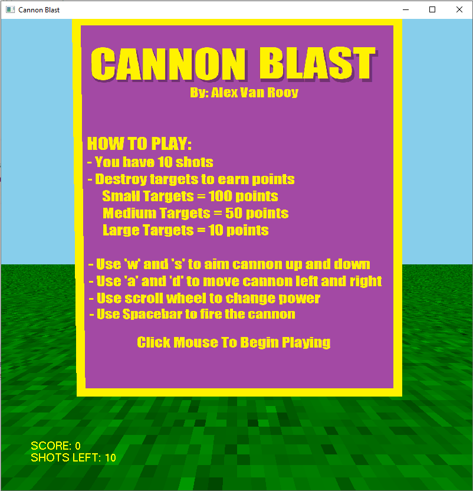
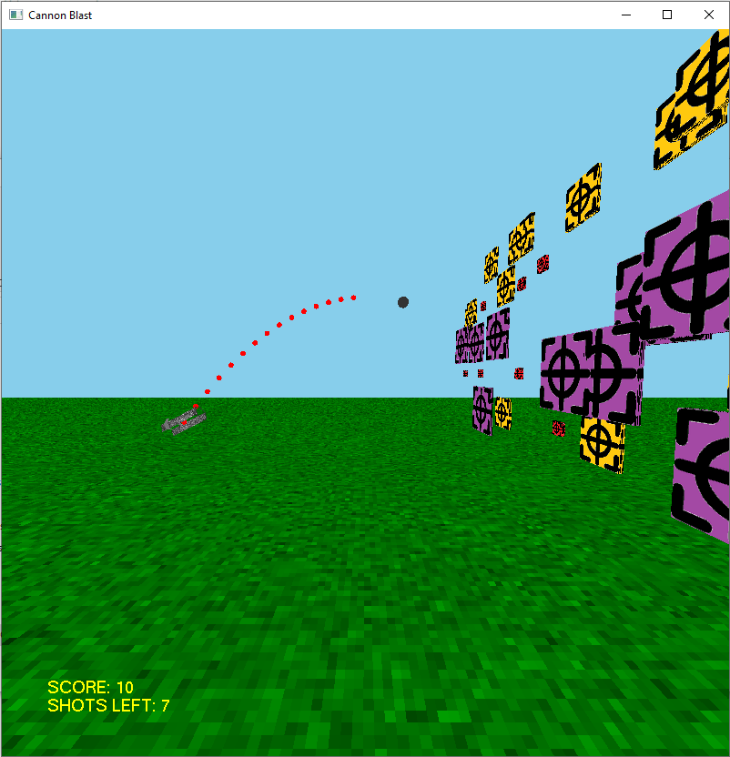
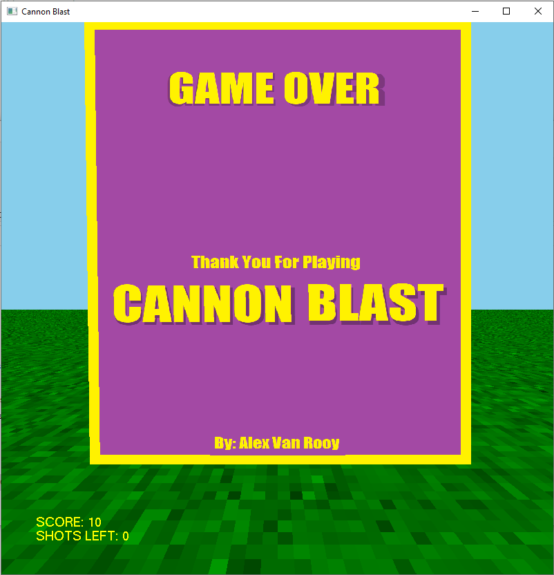

# CannonBlast
 A 3D Game made using C++ and OpenGL

 Author: Alex Van Rooy

## Introduction

### Description
Cannon Blast is a simple 3D game where the player takes control of a cannon and is tasked with destroying targets that are positioned far away from the cannon. The player can move the cannon to the left or right, as well as adjust the power of the cannon's shot and change the angle at which the cannon will fire. The players goal is to accumulate as many points as possible given the limited amount of shots they have. Each target will be of different size, with the smaller ones being worth more points.

### Key Features
- Player Controller
- Collision Detection
- Scoreboard
- Semi-Complex Models (i.e. Cannon)
- Sound Effects (i.e. When the cannon fires, when the cannon ball hits a target)

## Video Demonstration
Click [here](https://youtu.be/qrpkutSg-20) to watch the video demonstration.

## Screenshots

## Implementing Features

#### **Generating and Storing Targets**
The program requires that 30 targets of varying size (small, medium, large) be placed together within a grid-like formation for the player to be able to shoot them and acquire points. The first part of this problem is generating the targets of varying sizes. The targets are square shaped and come in 3 sizes; small, medium, large. There are two classes used for this problem, first is the Target class which contains information on the target such as, the points for hitting it, the size, and its position in 3D space. The second class is TargetGrid which will draw each target in the grid formation. The data structure that holds all the Target objects in an array. Out of the 30 targets, 8 are small, 12 are medium, and 10 are large. When the TargetGrid class generates each target it checks to see what size target is still needed and randomly chooses from the available ones. Once the Target object has been created and the size of the target has been selected, next the position of the target is determined, This is done using a random number generator and modulus arithmetic so that the result is contained within the dimensions of the grid. After all 30 targets have been generated, the resulting target grid has targets with random sizes positioned at random locations on the grid.

#### **Cannon Ball Path / Cannon Ball Animation**
The program centers around the gameplay mechanic of having a player position a cannon and fire a cannon ball at targets located in front of them, the problem is then how to calculate the path of a cannon ball given the position and properties of the cannon (angle and power), as well as how to display the cannon ball following the given path. To begin, the cannon ball path follows a parabolic line through 3D space, in 2D space the axis are the x and y-axis, in this program the cannon moves along the x-axis and fires a cannon ball perpendicular to the y-axis, so for this program the y-axis and the z-axis are what is used to calculate the cannon ball's position in the air. The equation of the parabola that the cannon ball follows is given by this equation: -(angle of cannon / power of cannon)x^2 + 2 * (angle of cannon) * x. When the equation is given all the information it produces the height of the ball(the z-axis value) and the desired position (y-axis value). This equation is used in conjunction with drawing the cannon ball as it moves across the path. To animate the ball moving across the path a repeating function is used that will increment the y-position of the cannon ball, calculate the z-value and re-draw the ball. This continues until the ball reaches a z-value of 0 which indicates it has hit the ground.

#### **Player Controller**
To implement the player controller I made use of the glut keyboard function which listens to keyboard events and, based off the key pressed, performs the specified action. In this case the keyboard function responded to 5 events, the events are:

- 'A' key pressed
- 'D' key pressed
- 'W' key pressed
- 'S' key pressed
- Spacebar pressed

The keys 'A' and 'D' move the cannon along the x-axis, the keys 'W' and 'S' angle the cannon up and down, and Spacebar fires the cannon.

The player can also use the mouse to perform some actions such as change camera, done by clicking left or right mouse button, and change power, done by using scroll wheel.

#### **Collision Detection**
To detect collision of the cannon ball with the target the position of the cannon ball was recorded at every location and compared with the position of each target in the target array. However, since the target is square a cannon ball can hit a distance away from xyz-coordinates of the target and still hit it. So the position of the cannon ball is compared with the area of a target to see if a collision happens. If a collision does occur then the target is set to not be drawn, and the player is awarded the points for hitting that target.

#### **Sound Effects**
To add sound effects to the game, windows API was used that allows for .wav files to be played. The two scenarios where a sound is played is when the cannon is fired and when a target is hit.

#### **Simple HUD**
There is a simple Heads-Up-Display (HUD) in the game that shows the players current score and the number of shots they have left. To do this the 3D world was first rendered out, then the 2D HUD was drawn on top of it by switching the display mode to draw on the projection. Then a second function which draws text to a screen position was used and the desired information was displayed.

## Design consideration 

### System Design
Each component in the application (i.e. the models, player controller, lighting, score keeping, etc) will be its own class and using the principles of object oriented programming the classes will interact with each other.   

### Architecture
The architecture of Cannon Blast will use the Model-View-Controller Architecture. The model will not need to retrieve or store any data into a database, all the data structures that will be used in the application are created at runtime. The view will be the display window that OpenGL creates, a user will have a main view which is when they are controlling the cannon, another view when firing the cannon ball, and a view to see their final score. The controller will respond to action events such as keyboard presses and mouse clicks and perform the respective action, the controller also updates the model over the course of the game as the user destroys targets, accumulates scores, moves their cannon, and so on.

## Requirements For CannonBlast

### System Requirements
- Windows OS
- C/C++ Compiler

### Required Dependencies
You will need the following libraries:

- opengl32
- freeglut
- glu32
- gdi32
- winmm
- glew32
